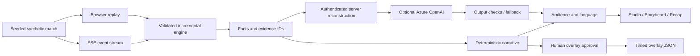

# Architecture and engineering decisions

## Implemented path

The static preview mode uses the browser path. The supplied Node server adds HTTP ingestion, SSE and optional model calls. The Azure blueprint runs that server in a single Azure Container Apps replica and calls an existing Azure OpenAI deployment. No Azure resources have been provisioned as part of this deliverable. A private Sites registration exists, but publication was blocked by automatic approval policy; no successful hosted deployment is claimed.

## Components

| Component | Code | Responsibility |
|---|---|---|
| Simulator | `dist/engine.mjs` | Seeded synthetic event generation and fictional roster |
| Validator and engine | `dist/engine.mjs` | Ordering, deduplication, statistics, tracking, windowed pattern rules |
| Narrator and personalization | `dist/engine.mjs` | Three languages, audience depth, filters and recaps |
| Web application | `dist/app.mjs`, `index.html`, `style.css` | Playback, pitch, controls, evidence, producer workflow |
| Pixel model | `dist/vision.mjs` | Train colour centroids and infer from sequential RGBA frames |
| API | `server.mjs` | HTTP serving, event ingest, SSE and grounded model requests |
| Azure adapter | `narrator.mjs` | Chat Completions request, timeout, parsing, evidence/numeric checks |
| Infrastructure | `infra/main.bicep` | Container Apps, Log Analytics, secret bindings and ingress allowlist |

## State and temporal correctness

Events have unique IDs, monotonically increasing sequence numbers and a match clock. Duplicate IDs do not change state. Earlier clocks or non-increasing sequence numbers are rejected. One engine cannot mix match IDs. This prototype rejects late data rather than reordering it; a production ingestion service should buffer against a watermark and recompute affected windows.

Playback processes only the prefix at or before the selected time. Seeking reconstructs state from that prefix. Insights never cite future events. The complete synthetic match is present in the browser for reproducibility, so it is not a secure prediction benchmark.

SSE sends IDs and resumes after the client's `Last-Event-ID`. It does not provide durable delivery guarantees across a changed seed or service version. The ingest endpoint stores up to 5,000 events in memory. State resets on restart; there is no database, cross-replica coordination, multi-tenant identity or production event bus.

## Language-model boundary

The client supplies a seed, time, insight ID and language/mode. The server reconstructs the match state, locates that insight and sends only its facts, fictional names, uncertainty and grounded narrative to Azure OpenAI. Client prose is not passed through as a trusted factual source.

The adapter accepts an HTTPS Azure resource endpoint and calls `/openai/v1/chat/completions`. Model output must be JSON containing `text` and `evidence_ids`. The checker rejects missing or unknown evidence, excessive text length, HTML and numeric claims outside the insight's facts. A response marked incomplete or filtered falls back to the rule version.

These checks do **not** prove semantic truth. A model could invent a number-free claim or change the meaning without adding new numeric values. All model prose remains a human-reviewed draft. The overlay path currently exports the deterministic narrative, so an unreviewed LLM output cannot silently replace the broadcast text. A future editor should review and explicitly commit model copy to an overlay revision.

There are at most two simultaneous model requests and twenty requests per minute per server process, plus a bounded cache. These are demo limits, not distributed abuse protection. Use real authentication, request quotas per user, content evaluation and persisted audit logs for production.

## Overlay timing

The contract uses match-relative milliseconds. `start_ms = insight time + feed delay`; `end_ms = start_ms + 12000`. Visibility is `start_ms <= feed_time_ms < end_ms`. A real renderer must map this clock to video presentation timestamps and handle replay seeks, halftime, clock discontinuities and media delays. The current browser preview implements only the documented match-clock contract.

## Security and operation

- Azure keys stay in server environment variables / Container Apps secrets, never in front-end bundles.
- Write and narration APIs require a minimum-24-character bearer token with timing-safe comparison. The UI keeps a supplied access token in memory only.
- Requests are capped at 128 KB. Static paths are constrained to `dist/`. Same-origin writes are enforced when an Origin header is present.
- The container runs as the unprivileged `node` user. TLS is terminated by Container Apps. The sample Bicep requires an explicit IP allowlist.
- The public read endpoints contain synthetic data only. The static preview has Sites owner-private access; this is distinct from the proposed Azure access model.
- No customer data, real football video, biometrics or production match data are included.

## Scaling after the hackathon

Persist ordered events and versions, partition processing by match, move windows to bounded buffers, replace whole-prefix reconstruction with checkpoints, cache facts once across audiences and coordinate quotas externally. Add a renderer consumer, durable editorial approval records, real user identity and production monitoring. These are future tasks, not hidden services implied by the current diagrams.
